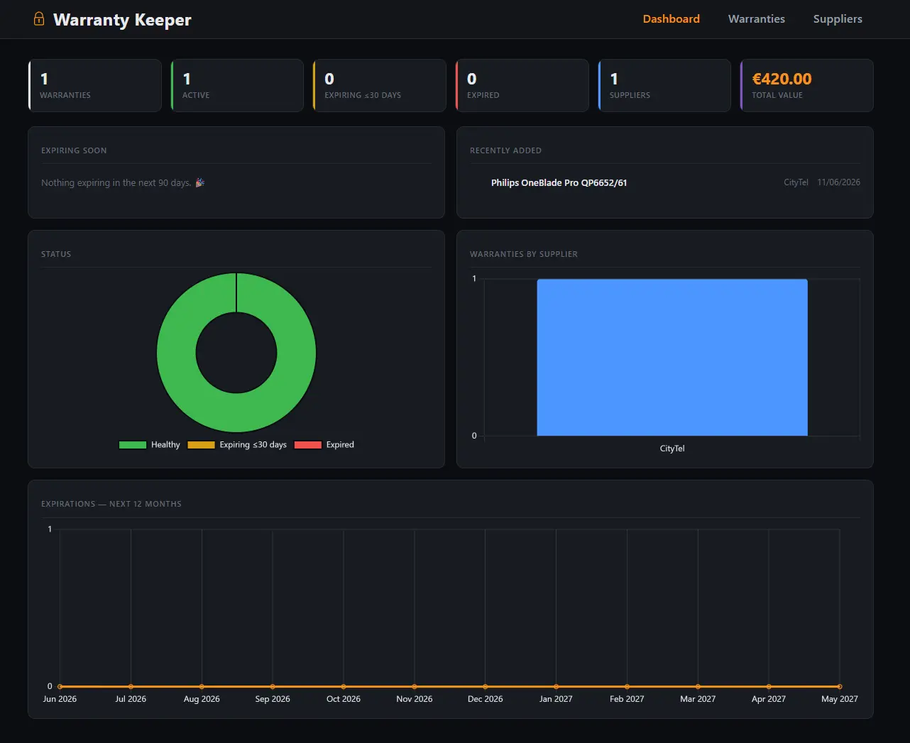

[](https://github.com/tonytech83/warranty_keeper/actions/workflows/django-ci.yml)

## WARRANTY KEEPER
Warranty Keeper is a Django web application for managing your warranties and suppliers.
Store purchase details, warranty periods, prices and supplier info, and keep an eye on
what's expiring from a single dashboard.

<div align="center" display="flex">
    
</div>

<br/>

### Features
- **Dashboard** with KPI cards (totals, active, expiring soon, expired, suppliers, total value),
  colour-coded "expiring soon" alerts, recently-added items, and charts (status, warranties per
  supplier, expirations over the next 12 months) powered by Chart.js.
- **Warranties** — create / view / edit / soft-delete, with item, purchase date, period, price,
  description, invoice image and supplier.
- **Suppliers** — create / view / edit / soft-delete, with logo, email, phone and website.
- **SQLite** storage — zero-config, file-based, easy to back up (just copy the `.db` file).

### Configuration
Copy `.env.example` to `.env` and adjust as needed:

| Variable        | Default                       | Description                                   |
| --------------- | ----------------------------- | --------------------------------------------- |
| `SECRET_KEY`    | insecure dev key              | Django secret key — **set your own**.         |
| `DEBUG`         | `True`                        | Set to `False` when exposing the app.         |
| `ALLOWED_HOSTS` | `localhost,127.0.0.1,[::1]`   | Comma-separated list of allowed hosts.        |
| `CURRENCY`      | `€`                           | Currency symbol shown next to prices.         |
| `SQLITE_PATH`   | `./db.sqlite3`                | Path to the SQLite database file.             |

### Run with Docker (recommended)
```bash
docker compose up --build
```
Then open http://localhost:8000. Migrations run automatically on startup.

The SQLite database and uploaded media are **bind-mounted to real files on the host**:

```
./data/db.sqlite3     # your database
./mediafiles/         # uploaded invoices & supplier logos
```

Because these live on the host (not inside the container), they survive
`docker compose down` and even `docker rm`. If a container is killed or rebuilt,
the next one simply reopens the same `./data/db.sqlite3`. To back up, just copy that
file. To start fresh, stop the app and delete `./data/db.sqlite3`.

### Run locally
```bash
python -m venv venv
# Windows: venv\Scripts\activate   |   Linux/macOS: source venv/bin/activate
pip install -r requirements.txt
python manage.py migrate
python manage.py runserver
```

To use the Django admin, create a superuser: `python manage.py createsuperuser`.

<h6 align="center"> Made by Anton Petrov </h6>
