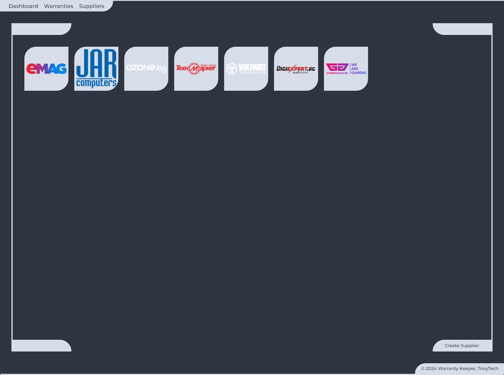

# >> UNDER CONSTRUCTION <<
## WARRANTY KEEPER
Warranty Keeper is a Django web-based application designed to manage your warranties and supplier details efficiently. It provides an easy-to-use interface for storing and tracking warranty information, including purchase details, warranty periods, and associated suppliers.

    

 

<h6 align="center"> Made with by Anton Petrov </h6>
